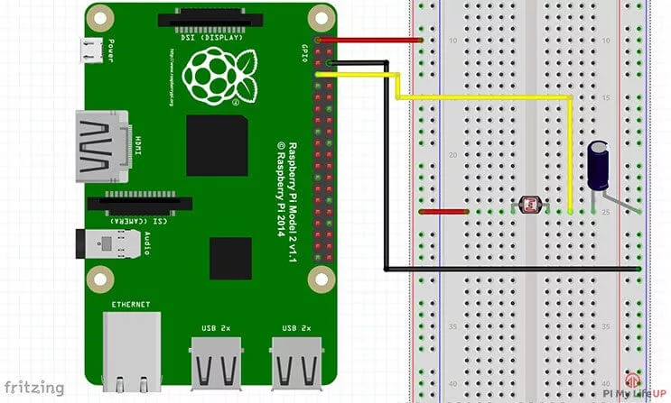
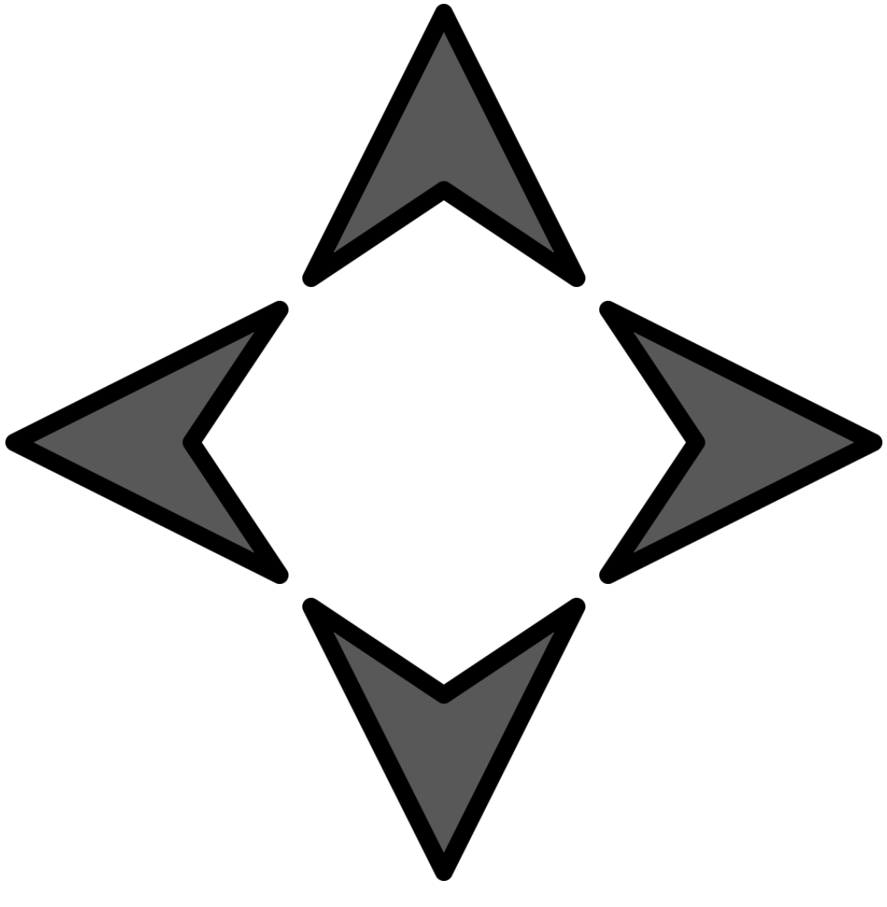

# Doc
##  How to use `LDR`

- `The cable setup for the LDR:`
  

- `def __init__(self, name, pin, number):`
  - Initilizie a new object with the name, pin number and number for the LDR as seen above.
- `def calibration(self):` 
  - Use this first to calibrate the LDR depending on the light source.
- `def resistor_count(self):`
    - Use this method to get the value back from the LDR. 
- `def read_ldr(self):` 
  - Use this to get the value back from the LDR with the number of the LDR.
- `def check_light(self):`
  - Use this to check if there is an object blocking the LDR (If there is a shadow blocking the light).

## `Config` Guide

- Use this file to declare all the objects of the class and to save/change the pin numbers as variables.
- To change the number of samples in the calibration / the intervals change the following values.
`calibration_samples = 5`
`calibration_samples_interval = 0.2`

## Website

### `game.html`, `style.css`, `script.js`
 
- The html file is for the content of the site so the arrows and for calling the script.js file and running its method.
- The css file is for the grid layout of the site. 
- The javascript file is for changing the grey arrows to white arrows when a direction is given.

## Functions

- `def print_ldr_values():`
  - Use this to print out the LDR values 1 by 1.
  - This is a function for testing.
  
- `def calibration_sensors():`
  - Use this to calibrate the sensors. 
  
- `def print_stack():`
  - Use this to print the stack. 
  
- `def check():`
  - This function runs the class function for each ldr to check if there is a shadow/object.
  
- `def find_direction():`
  - This is the current method for finding out which direction is being swiped to but its 
  not working properly, so it needs work. 

## main 

- `def game():`
  - This is where I run all the code beside the website code.
  
- `Multithreading`
  - Multithreading is used here to run the website and the `game()` method at the same time.
